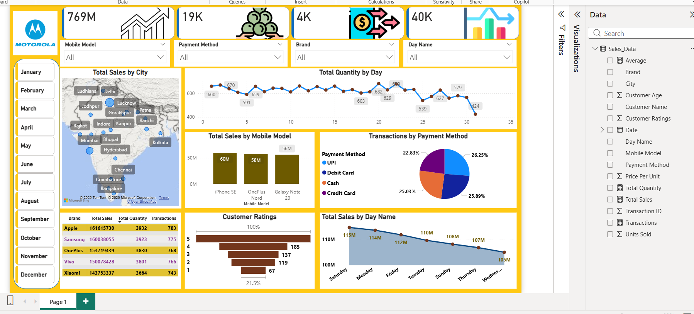

# 📊 Mobile Sales Analysis - Power BI Dashboard

An interactive Power BI dashboard designed to analyze mobile phone sales performance across
multiple cities in India. It provides deep insights into revenue, transactions, customer 
ratings, and buying patterns to support data-driven business decisions.

---

## 🖼️ Dashboard Preview

---

## 📌 Key Metrics
| Metric | Value |
|--------|-------|
| 💰 Total Sales | 769M |
| 👥 Total Customers | 19K |
| 🔄 Total Transactions | 4K |
| 📦 Total Quantity Sold | 40K |

---

## 🔍 Key Insights

- **Top Brands by Sales:**
  - 🥇 Apple — ₹161.6M (3,932 units, 783 transactions)
  - 🥈 Samsung — ₹160M (3,923 units, 775 transactions)
  - 🥉 OnePlus — ₹153.7M (3,830 units, 768 transactions)
  - Vivo — ₹150M | Xiaomi — ₹143.7M

- **Top Mobile Models by Sales:**
  - Galaxy Note 20 — 56M
  - iPhone SE — 60M
  - OnePlus Nord — 58M

- **Sales by City:** Covers major Indian cities including Delhi, Mumbai, 
  Bangalore, Hyderabad, Kolkata, Chennai, Lucknow, Indore, and more

- **Transactions by Payment Method:**
  - Credit Card — 25.89%
  - UPI — 26.25%
  - Cash — 25.03%
  - Debit Card — 22.83%

- **Customer Ratings:**
  - Majority rated 5 ⭐ (highest bar)
  - Overall positive satisfaction trend

- **Sales by Day:** Saturday leads with 115M, Wednesday lowest at 105M

---

## 📊 Visuals Included

- 🗺️ **Map** — Total Sales by City (India)
- 📈 **Line Chart** — Total Quantity by Day
- 📊 **Bar Chart** — Total Sales by Mobile Model
- 🥧 **Pie Chart** — Transactions by Payment Method
- 📋 **Table** — Brand-wise Sales, Quantity & Transactions
- 📉 **Area Chart** — Total Sales by Day Name
- ⭐ **Bar Chart** — Customer Ratings Distribution

---

## 🎛️ Filters / Slicers

- 📅 Month (January – December)
- 📱 Mobile Model
- 💳 Payment Method
- 🏷️ Brand
- 📆 Day Name

---

## 🛠️ Tools & Technologies

- **Power BI Desktop** — Dashboard creation & visualization
- **Microsoft Excel / CSV** — Data source
- **DAX** — Calculated measures and KPIs
- **Bing Maps** — Geographic visualization

---

## 📁 Project Structure
📦 Mobile-Sales-Analysis-Power-BI-Dashboard
┣ 📊 MobileSalesAnalysis.pbix
┣ 📋 Sales_Data.xlsx
┣ 🖼️ dashboard.png
┗ 📄 README.md

---

## 🚀 How to Use

1. Clone or download this repository
2. Open `MobileSalesAnalysis.pbix` in **Power BI Desktop**
3. Refresh the data source if needed
4. Use the slicers to filter by Month, Brand, Payment Method, etc.
5. Explore the interactive visuals

---

## 👨‍💻 Author

**Akash**
- GitHub: [@imakash45](https://github.com/imakash45)
